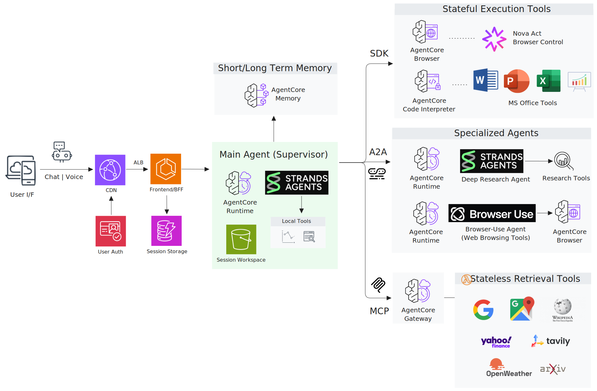

# Strands Agent Chatbot with Amazon Bedrock AgentCore

An end-to-end reference architecture for building **agentic workflows** using  
**Strands Agents** and **Amazon Bedrock AgentCore**.

This repository demonstrates how to design and deploy a multi-agent chatbot that combines
tool execution, memory, browser automation, and agent-to-agent collaboration.
It is intended as a realistic, extensible sample for teams exploring advanced agent architectures on AWS.

---

## Demo

https://github.com/user-attachments/assets/11b383c2-2e14-4135-833f-b0b2bce62953

> **[Full demo (6 min)](https://drive.google.com/file/d/1Hk4hgiqqMntNRUN1xDkwcbJUA8MVEJEA/view?usp=sharing)**

**Scenarios covered in the demo:**

| Scenario | Tools | What it does |
|----------|-------|--------------|
| **Personal AI Agent** | Notion, Gmail, Google Maps, Google Calendar | Check to-dos, find emails, get directions, set reminders |
| **Financial Research** | Finance, Google Search, Deep Research | Analyze crypto price history, summarize market news, compare bear markets |
| **Document Generation** | Presentation, Code Interpreter | Build an executive deck with charts from research results |
| **Autonomous Browsing** | Amazon Nova Act, AgentCore Browser | Search Google Flights and extract results |

---

## What this repository demonstrates

- Multi-agent orchestration with **Strands Agents**
- Integration with **Amazon Bedrock AgentCore**
- Tool-enabled agents (search, finance, weather, browser, code interpreter)
- Autonomous browser, documentation, and analysis workflows
- Modular architecture adaptable to real customer use cases
- Infrastructure-as-Code (CDK) for repeatable deployment

If you are building **agentic AI applications on AWS** and want a concrete, end-to-end example,
this repository is designed to be read, run, and extended.

**Quick links:**  
[Architecture](#architecture-overview) · [Key Features](#key-features) · [Quick Start](#quick-start)

---

## Architecture Overview

This sample combines **Strands Agent orchestration** with **Amazon Bedrock AgentCore services**:

| Component | Role |
|-----------|------|
| **Strands Agents** | Multi-turn reasoning and tool orchestration |
| **AgentCore Runtime** | Managed, containerized agent execution |
| **AgentCore Memory** | Persistent conversation state and summarization |
| **AgentCore Gateway** | MCP-based tool integration with SigV4 authentication |
| **AgentCore Code Interpreter** | Secure Python execution for analysis and document generation |
| **AgentCore Browser** | Headless browser automation with live view |
| **AgentCore Identity** | End-user authentication and 3LO OAuth delegation |
| **AgentCore Observability** | Trace collection and agent execution monitoring |
| **Amazon Nova Act** | Visual reasoning model for browser automation |



---

## Key Features

- Strands-based agent orchestration
- Amazon Bedrock AgentCore Runtime, Gateway, and Memory
- MCP Gateway tools (Google, Wikipedia, ArXiv, Yahoo Finance, Tavily, Open-Meteo)
- Agent-to-Agent (A2A) collaboration
- Built-in Code Interpreter for charts and documents
- Multimodal input and output (vision, charts, documents, screenshots)
- Real-time voice interaction with Amazon Nova Sonic 2

---

## Skill System (Progressive Disclosure)

Tools are organized into **skills** — grouped units with SKILL.md instructions that the agent loads on demand.
Instead of injecting all tool documentation into every prompt, the agent activates only the skills it needs:

1. **L1 Catalog** — Skill names and one-line descriptions (always in system prompt)
2. **L2 Instructions** — Full SKILL.md loaded via `skill_dispatcher` when activated
3. **L3 Execution** — Tool calls via `skill_executor`

This keeps prompt size small while giving the agent access to detailed instructions when needed.

Design notes:
- https://medium.com/towards-artificial-intelligence/agent-skills-part-2-bridging-skills-with-production-tool-ecosystems-422e4a63fcad

```
skills/
├── visual-design/          # Charts, posters, infographics (Code Interpreter)
├── code-interpreter/       # General code execution
├── browser-automation/     # Nova Act browser tools
├── word-documents/         # Word document generation
├── excel-spreadsheets/     # Excel spreadsheet generation
├── powerpoint-presentations/  # PowerPoint generation
├── gmail/                  # Gmail read/search/delete (3LO OAuth)
├── google-calendar/        # Calendar events (3LO OAuth)
├── notion/                 # Notion pages and databases (3LO OAuth)
├── github/                 # GitHub repos, issues, PRs, code (3LO OAuth)
└── ...                     # 20+ skills (web search, finance, maps, weather, and more)
```

---

## Multi-Protocol Tool Architecture

| Tool Category | Protocol | Examples | Authentication |
|--------------|----------|----------|----------------|
| Local Tools | Direct Python | Web Search, URL Fetcher, Visualization | None |
| Built-in Tools | AWS SDK / WebSocket | Code Interpreter, Browser (Nova Act) | IAM |
| Gateway Tools | MCP | Google Search, Maps, Wikipedia, ArXiv, Finance | SigV4 |
| Private API Tools | MCP (3LO OAuth) | Gmail, Google Calendar, Notion, GitHub | OAuth 2.0 |
| A2A Tools | A2A | Research Agent, Browser-Use Agent | SigV4 |

Total: **100+ tools across 20 tool groups**
See [docs/guides/TOOLS.md](docs/guides/TOOLS.md) for full details.

---

## Voice Mode

Real-time voice interaction using **Amazon Nova Sonic 2**, **Strands BidiAgent**,
and **AgentCore Runtime WebSocket**.

- Seamless switching between voice and text within a single session
- Shared conversation history across both modes
- Full tool execution support during voice conversations

---

## Memory Architecture and Long-Context Management

The system uses **AgentCore Memory** with:
- Short-term session memory
- Long-term summarized memory

Long conversations are compacted using a context summarization strategy to
retain key information while controlling token growth.

Design notes:
- https://medium.com/@revoir07/long-context-compaction-for-ai-agents-part-1-design-principles-2bf4a5748154

---

## Token Optimization via Prompt Caching

Prompt caching reduces input token usage by reusing system prompts, stable instruction blocks,
and repeated conversation context across agent loop iterations.

This project originally implemented caching via custom Strands hooks.
The approach has since been upstreamed into the Strands SDK as a built-in feature
([strands-agents/sdk-python#1438](https://github.com/strands-agents/sdk-python/pull/1438)):

```python
from strands.models import BedrockModel, CacheConfig

model = BedrockModel(
    model_id="us.anthropic.claude-sonnet-4-6-v1",
    cache_config=CacheConfig(strategy="auto")
)
```

Design notes:
- https://medium.com/@revoir07/agent-loop-caching-the-missing-optimization-for-agent-workflows-230cc530eb72

---

## Multi-Agent Architecture

Agent-to-Agent communication is handled via the **A2A protocol**, allowing the supervisor agent to delegate tasks to specialized worker agents such as a deep research agent.
Multiple agents collaborating in sequence — each handling its own role — are coordinated using the **Swarm** pattern.

Design notes:
- https://medium.com/@revoir07/extend-your-chatbot-with-deep-research-using-a2a-ba4de3ed23e9

---

## Use Cases

- Financial research agents
- Technical research assistants using multi-agent patterns
- Autonomous web automation agents
- Memory-backed conversational assistants
- Hybrid research workflows using MCP, A2A, and AWS SDK tools

---

## Quick Start

### Prerequisites

- AWS account with Bedrock access  
- AWS CLI configured  
- Docker installed  
- Node.js 18+ and Python 3.13+  

---

### Local Development

```bash
git clone https://github.com/aws-samples/sample-strands-agent-with-agentcore.git
cd sample-strands-agent-with-agentcore

cd chatbot-app
./setup.sh

cd ../agent-blueprint
cp .env.example .env
# configure credentials

cd ../chatbot-app
./start.sh
```

Frontend will be available at http://localhost:3000.

---

### Cloud Deployment

The interactive deployment script supports:
	1.	AgentCore Runtime
	2.	Frontend + BFF
	3.	MCP Gateway tools
	4.	A2A runtimes
	5.	Full stack deployment
```
cd agent-blueprint
./deploy.sh
```

### Project Structure
```
sample-strands-agent-chatbot/
├── chatbot-app/
│   ├── frontend/
│   └── agentcore/
└── agent-blueprint/
    ├── chatbot-deployment/
    ├── agentcore-gateway-stack/
    ├── agentcore-runtime-stack/
    └── agentcore-runtime-a2a-stack/
```

## Documentation

- DEPLOYMENT.md
- docs/guides/TROUBLESHOOTING.md

---

## License

MIT License. See LICENSE for details.
